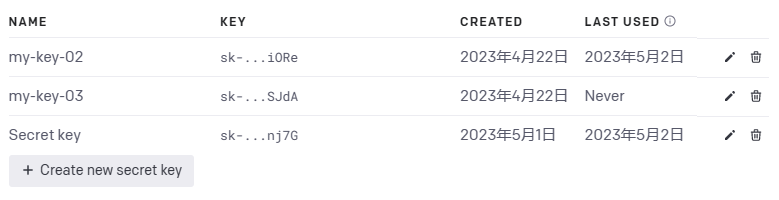

# 快速开始
OpenAI已经训练了先进的语言模型，非常擅长理解和生成文本。我们的API提供对这些模型的访问，并可用于解决几乎涉及语言处理的任何任务。

在此快速入门教程中，您将构建一个简单的示例应用程序。在此过程中，您将学习到使用API解决任何任务所必需的关键概念和技术，包括：

- 内容生成
- 摘要
- 分类、分类和情感分析
- 数据提取
- 翻译

还有更多！

## 介绍
完成端点(The completions endpoint)是我们API的核心，提供了一个非常灵活和强大的简单界面。您输入一些文本作为提示，API将返回一个文本完成，尝试匹配您给出的任何指令或上下文。

英  
Prompt Write a tagline for an ice cream shop.  
Completion We serve up smiles with every scoop!  
中   
提示 为一家冰淇淋店编写一个标语。  
完成 我们每一勺都传递快乐！  

您可以将其视为非常先进的自动完成 - 模型处理您的文本提示并尝试预测最有可能出现的内容。

## 从指令开始
想象一下，您想创建一个宠物名称生成器。从头开始想出名字很难！

首先，您需要一个清晰表达您想要的提示。让我们从指令开始。提交这个提示以生成您的第一个完成。

为一匹马建议一个名字。  
闪电  

不错！现在，尝试让您的指令更具体。  

为一匹黑马建议一个名字。  
午夜  

正如您所看到的，将一个简单的形容词添加到我们的提示中可以改变生成的完成结果。设计您的提示本质上就是“编程”模型的方法。  

添加一些示例
制作良好的指令对于获得良好的结果非常重要，但有时它们还不够。让我们尝试让您的指令更复杂。  

为一匹作为超级英雄的马建议三个名字。

超级骏马  
队长马科尔特  
强大的野马  
这个完成不完全是我们想要的。这些名称非常通用，并且似乎模型没有注意到我们指令中的马。让我们看看是否可以让它提供更相关的建议。
在许多情况下，向模型展示和告诉您要什么是有帮助的。将示例添加到您的提示中可以帮助传达模式或细微差别。尝试提交包含一些示例的此提示。

为一种作为超级英雄的动物建议三个名字。

动物：猫
名字：队长尖爪，特工毛球，不可思议的猫
动物：狗
名字：保护者拉夫，奇迹犬，史上最吠-a-多
动物：马
名字：

超级骏马，强大的母马，壮丽的马

很好！为特定输入期望的输出添加示例有助于模型提供我们正在寻找的类型名称。

## 调整您的设置
提示设计不是您掌握的唯一工具。您还可以通过调整设置来控制完成。其中最重要的设置之一称为温度(temperature)。

您可能已经注意到，在上面的示例中多次提交相同的提示，模型总是返回相同或非常相似的完成。这是因为您的温度设置为0。

尝试以1的温度重新提交相同的提示。

为一种作为超级英雄的动物建议三个名字。

动物：猫
名字：队长尖爪，特工毛球，不可思议的猫
动物：狗
名字：保护者拉夫，奇迹犬，史上最吠-a-多
动物：马
名字：
强大的马，超级骏马，队长马蹄声
温度 1
看看发生了什么？当温度高于0时，提交相同的提示每次都会产生不同的完成。

（例子：在温度1的情况下，三次提供相同提示）
1. Equinox Avenger（昼夜平分侠），Super Stallion（超级草原之驹），Majestic Marvel（壮丽奇迹）
2. The Magnificent Mane（华丽之鬃），Noble Neigh（高贵之鸣），Mighty Hoof-Man（勇猛之蹄人）
3. Supersteed（超级战马），Outrider（前锋），Dashin' POWER-Loper（灵活超能奔马）

当温度高于0时，重复提交相同的提示会导致不同的完成结果产生。请记住，该模型预测文本跟在前面文本后面的可能性最大。温度是0到1之间的值，本质上让您控制模型在进行这些预测时信心的大小。降低温度意味着模型会冒更少的风险，完成结果会更加准确和确定性。提高温度将导致更多样化的完成结果。

## 深入了解 tokens 和概率
我们的模型通过将文本分解为称为 tokens 的较小单元来处理文本。Tokens 可以是单词、单词块或单个字符。编辑下面的文本以查看其如何被分词。

我有一只名叫 Butterscotch 的橙色猫。
我有一只名叫 Butterscotch 的橙色猫。
像“cat”这样的常见单词是一个单独的 token，而不常见的单词通常会被分解为多个 tokens。例如，“Butterscotch”被翻译为四个 tokens：“But”、“ters”、“cot”和“ch”。许多 tokens 以空格开头，例如“ hello”和“ bye”。

对于一些文本，模型确定下一个最有可能出现的 token。例如，文本“Horses are my favorite”最有可能跟随着 token“ animal”。
文本：Horses are my favorite
接下来出现其他词汇的概率：
animal 49.65%, animals 42.58%, \n 3.49%, ! 0.91%
这就是温度发挥作用的地方。如果您将此提示提交4次并将温度设置为0，则模型总是会返回“ animal”，因为它具有最高的概率。如果您增加温度，它将冒更大的风险并考虑概率较低的 tokens。

对于您的宠物名字生成器，您可能希望能够生成许多名字的想法。温度为 0.6 的中等温度应该效果不错。

## 构建你的应用程序

现在，你已经找到了一个好的提示和设置，准备构建你的宠物名字生成器！我们已经编写了一些代码来帮助你入手，按照以下说明下载代码并运行应用程序。

### 设置
如果你没有安装Node.js，可以从这里安装。然后通过克隆此存储库来下载代码。
如果你没有安装python，可以从这里安装。然后通过克隆此存储库来下载代码。

node.js
git clone https://github.com/openai/openai-quickstart-node.git
python
git clone https://github.com/openai/openai-quickstart-python.git

node.js
如果你不想使用git，你也可以使用这个zip文件来下载代码。
python
如果你不想使用git，你也可以使用这个zip文件来下载代码。

添加你的API密钥
进入项目目录并复制示例环境变量文件。
node.js
cd openai-quickstart-node
cp .env.example .env

python
cd openai-quickstart-python
cp .env.example .env

将你的秘密API密钥复制并设置为新创建的.env文件中的OPENAI_API_KEY。如果你还没有创建秘密密钥，可以在下面进行创建。

重要提示：当使用Javascript时，所有API调用应仅在服务器端进行，因为在客户端浏览器代码中进行调用将会暴露你的API密钥。请参阅此处以获取更多详细信息。

